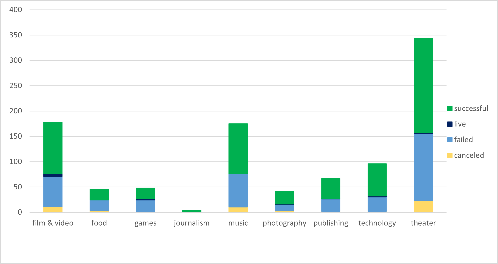
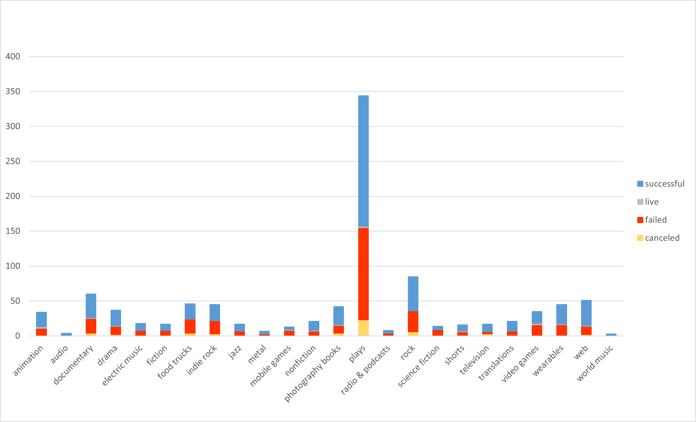
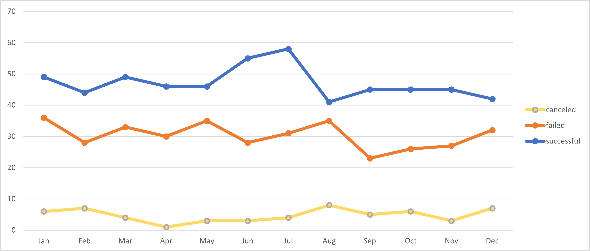
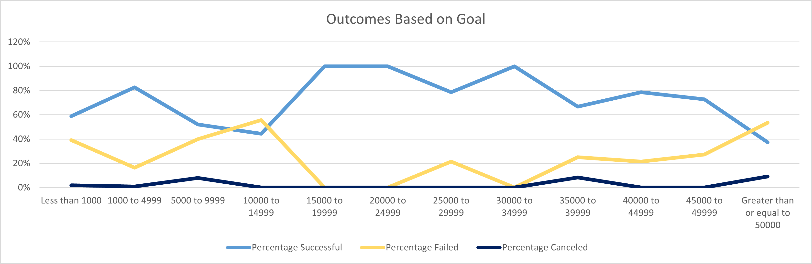
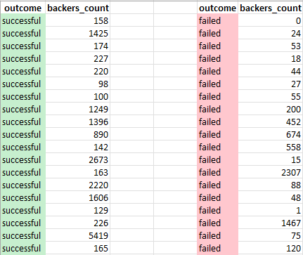

# Excel Challenge: Charting Crowdfunding

## Background

Crowdfunding platforms like Kickstarter and Indiegogo have been growing in success and popularity since they began in the late aughts. Everyone from indie creators to famous celebrities have utilized crowdfunding to launch new products and generate buzz, but not every project has found success.

Getting funded on a crowdfunding website requires meeting or exceeding the project's initial goal, so many organizations spend months looking through past projects in an attempt to discover some trick for finding success. For this week's homework, you will organize and analyze a database of 1,000 generated sample projects in order to uncover any hidden trends.

## Challenges performed

Modified and analyzied the Crowdfunding data of 1,000 example projects in an attempt to uncover market trends. 

1. Updated the Excel sheet with the following formatting and addition of columns. 

    * Used conditional formatting to fill each cell in the `outcome` column with a different color, depending on whether the associated campaign was successful, failed, canceled, or is currently live.

    * Created a new column called `Percent Funded` that uses a formula to uncover how much money a campaign made relative to its initial goal.

    * Used conditional formatting to fill each cell in the `Percent Funded` column according to a three-color scale. The scale started at 0 with a dark shade of red, transitioning to green at 100, and blue at 200.

    * Created a new column called `Average Donation` that uses a formula to uncover how much each project backer paid on average.

    * Created two new columns, one called `Parent Category` and another called `Sub-Category`, that use formulas to split the `Category and Sub-Category` column into the two new, separate columns.

    * The dates stored within the `deadline` and `launched_at` columns used Unix timestamps. 

    * Created a new column named `Date Created Conversion` and used a formula to convert the data contained within `launched_at` into Excel's date format.

    * Created another new column named `Date Ended Conversion` and used a formula to convert the data contained within `deadline` into Excel's date format.

2. Created a new sheet with a pivot table that provided how many campaigns were successful, failed, canceled, or are currently live per **category**.

    * Created a stacked column pivot chart that can be filtered by country based on the pivot table created.
    
 
 

3. Created a new sheet with a pivot table that will analyze the initial sheet to count how many campaigns were successful, failed, or canceled, or are currently live per **sub-category**.

    * Created a stacked column pivot chart that can be filtered by country and parent-category based on the pivot table created.

 

 
4. Created a new sheet with a pivot table with a column of `outcome`, rows of `Date Created Conversion`, values based on the count of `outcome`, and filters based on `parent category` and `Years`.

* Then created a pivot chart line graph that visualizes this new table.

 
 
  
## Bonus_Challenge_1

* Created a new sheet with 8 columns:

  * `Goal`
  * `Number Successful`
  * `Number Failed`
  * `Number Canceled`
  * `Total Projects`
  * `Percentage Successful`
  * `Percentage Failed`
  * `Percentage Canceled`

* In the `Goal` column, created 12 rows with the following headers:

  * Less than 1000
  * 1000 to 4999
  * 5000 to 9999
  * 10000 to 14999
  * 15000 to 19999
  * 20000 to 24999
  * 25000 to 29999
  * 30000 to 34999
  * 35000 to 39999
  * 40000 to 44999
  * 45000 to 49999
  * Greater than or equal to 50000

* Using the `COUNTIFS()` formula, counted how many successful, failed, and canceled projects were created with goals within the ranges listed above. Populated the `Number Successful`, `Number Failed`, and `Number Canceled` columns with this data.

* Populated the "Total Projects" column with the sum of values in the `Number Successful`, `Number Failed`, and `Number Canceled` columns. Then, using a mathematical formula, updated the percentage of projects that were successful, failed, or canceled per goal range.

* Created a line chart that graphs the relationship between a goal amount and its chances of success, failure, or cancellation.

## Bonus_Challenge_2_Statistical Analysis

* Created a new worksheet, and created one column for the number of backers of successful campaigns and one column for unsuccessful campaigns.

  * Used Excel to evaluate the following for successful campaigns, and then did the same for unsuccessful campaigns:

  * The mean number of backers
  * The median number of backers
  * The minimum number of backers
  * The maximum number of backers
  * The variance of the number of backers
  * The standard deviation of the number of backers

## Updated Excel

